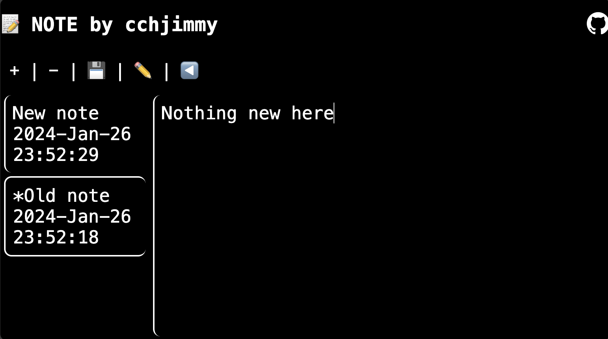

# 📝 NOTE

A simple note taking app in the [browser](https://cchjimmy.github.io/NOTE/).
Feel free to create pull requests to suggest features and quality of life
changes to help me improve the app.

## Features

- "+" New blank note
- "-" Delete current note
- "💾" Save current note
- "✏️" Change note title
- "◀️" Toggle sidebar visibility
